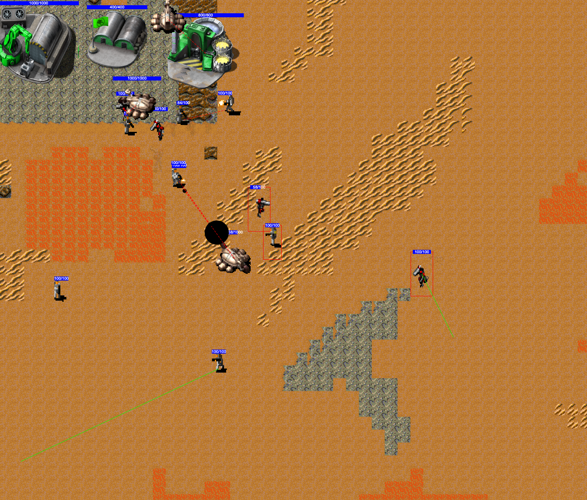

# Retro Javascript Valina RTS game

This project is a retro-style real-time strategy game, inspired by games such as Dune, Command & Conquer, and Red Alert. It is built using Javascript and HTML5 Canvas.

In this game, players will be able to build and manage their own base, train and command an army, and engage in battles with other players or computer-controlled enemies. The goal is to emerge victorious by outsmarting and defeating your opponents.

To get started, clone or download the repository, and open the index.html file in your web browser. Follow the in-game instructions to begin playing.
Or use htis link: https://zeevgl.github.io/retro-rts-game/

Please note that this game is still a work in progress, and there may be bugs or unfinished features. If you encounter any issues or have suggestions for improvements, feel free to open an issue or submit a pull request.

### Demo: https://zeevgl.github.io/retro-rts-game/

